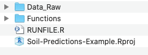

# Getting Started

The best way to get started using this code, is by downloading the `Soil-Predictions-Example` folder found here:    
[**Soil-Predictions-Example Folder**](https://github.com/whrc/Soil-Predictions-MIR/tree/master/Soil-Predictions-Example)

This folder, along with all source code for this guide, can be found in the following Github Repository:    
[**whrc/Soil-Predictions-MIR**](https://github.com/whrc/Soil-Predictions-MIR)

## File Walkthrough {-}
1. Within the `Soil-Predictions-Example` folder, you will find the following folders and files:     


2. Double click `Soil-Predictions-Example.Rproj` to open up the **R-project**. Within a project, the working directory is set to the project's folder.
<!-- Add picture when possible -->

3. Open up `RUNFILE.R` in the project environment. This is an example script of how to make soil predictions using spectral data. It includes the use of both **PLSR** models and **MBL** models, which are both explained in this guide. 

4. Navigate to the `Functions` folder. Within this folder are R files containing functions useful for MIR soil predictions. These files will be sourced by each other, and `RUNFILE.R`      


5. Navigate to the `Data_Raw` folder. This should contain:    
    + `LAB_DATA.csv`: A '.csv' file of the lab data; At a minimum,  it should have a `sample_id` column and the lab data for a given property
    + `SPECTRA`: A folder of OPUS files containing the spectral data for each sample   

    
## Required Packages {-}
Open up `RUNFILE.R` and install the packages listed at the top:    

```{r, eval=FALSE}
install.packages(stringr)      # processing spectra
install.packages(foreach)      # processing spectra
install.packages(prospectr)    # processing spectral set
install.packages(clhs)         # processing large sets {optional}
install.packages(matrixStats)  # preprocessing baseline transformation
install.packages(plot3D)       # preprocessing plotting spectral outliers {optional}
install.packages(pls)          # pls models
install.packages(resemble)     # mbl models
```

### simplerspec {-}
[***simplerspec documentation***](https://github.com/philipp-baumann/simplerspec) 
`simplerspec` is a package that streamlines the process of making models from FT-IR data. However, we were unable to install it and ended up just manually saving the functions `read-opus-universal` and `gather-spc` to the folder `Functions/simplerspec`    
  


### stringr {-}
[***stringr documentation***](https://cran.r-project.org/web/packages/stringr/vignettes/stringr.html)
`stringr` is used in the processing spectra portion of the code for subsetting strings with the `str_sub` function    

### foreach {-}
[***foreach documentation***](https://cran.r-project.org/web/packages/foreach/vignettes/foreach.html)
`foreach` is in the processing spectra portion of the code within the simplrspec function `read-opus-universal`    

### prospectr {-}
[***prospectr documentation***](https://github.com/l-ramirez-lopez/prospectr) 
`prospectr` is used in the processing portion of the code to split it into calibration and validation sets using the function `kenStone()`    


### clhs {-}
[***clhs documentation***](https://cran.r-project.org/web/packages/clhs/clhs.pdf)
`clhs` or Conditional Latin Hypercube Sampling is used in the processing portion of the code to subset large datasets that exceed 15000 samples    


### matrixStats {-}
[***matrixStats documentation***](https://cran.rstudio.com/web/packages/matrixStats/index.html)
`matrixStats` is used in the `base_offset` function in the preprocessing portion of the code.    

### plot3D {-}
[**plot3D documentation**](http://www.sthda.com/english/wiki/impressive-package-for-3d-and-4d-graph-r-software-and-data-visualization)
`plot3D` is used within the `fratio_outliers` function to show spectral outliers in 3D principal component space.    

### pls {-}
[***pls documentation***](https://cran.r-project.org/web/packages/pls/vignettes/pls-manual.pdf)
`pls` is used to create partial least squares regression models.  

### resemble {-}
[***resemble documentation***](https://github.com/l-ramirez-lopez/resemble)
`resemble` is used to create memory based learner models.    


## Demo Script {-}
Run the `RUNFILE.R` script. This will create...     

1. `Data_Processed`: A folder containing the processed data, used to build the model and make predictions     
2. `Models`: A folder containing the plsr and mbl models made    
3. `Predictions`: A folder containing the predictions output by the script and a prediction performance log   

To modify for your own spectral library....

1. Change the spectral files in `Data_Raw/SPECTRA`    
2. Change the lab data in `Data_Raw/LAB_DATA.csv`
3. Update the name of the property in `RUNFILE.R`, to match the column name of the property you would like to predict. Currently, we are predicted for "OC".


Below is the full `RUNFILE.R` script, organized with 3 main sections & their corresponding functions, linked below and described in sections 4-7 of this guide.

1. Data Preprocessing      
    + [`getSpecLib()`](https://whrc.github.io/Soil-Predictions-MIR/data-preprocessing.html#getspeclib)    
    + [`refineSpecLib()`](https://whrc.github.io/Soil-Predictions-MIR/data-preprocessing.html#refinespeclib)    
    
2. PLSR Models    
    + [`makePLSModel()`](https://whrc.github.io/Soil-Predictions-MIR/plsr-models.html#makeplsmodel)
    + [`getModResults()`](https://whrc.github.io/Soil-Predictions-MIR/model-performance.html#getmodresults)
        + [`getPredPLS()`](https://whrc.github.io/Soil-Predictions-MIR/plsr-models.html#getpredpls)    
    
3. MBL Models    
    + [`runMBL()`](https://whrc.github.io/Soil-Predictions-MIR/mbl-models.html#runmbl)
    + [`getModResults()`](https://whrc.github.io/Soil-Predictions-MIR/model-performance.html#getmodresults)
        + [`getPredMBL()`](https://whrc.github.io/Soil-Predictions-MIR/mbl-models.html#getpredmbl)

```{r, eval=FALSE}
#----------------------------------------------#
# Data Preprocessing #
#----------------------------------------------#
source("Functions/preprocess_functions.R")

# Get Spectral Library Set
ALL_data <- getSpecLib(SAVENAME="ALL_data")

# Refine Spectral Library
OC_data <- refineSpecLib(SPECLIB=ALL_data, PROP="OC", CALVAL=TRUE, SAVENAME="OC_data")

# Define Reference and Prediction Sets
refSet <- OC_data[OC_data$calib==1,]
predSet <- OC_data[OC_data$calib==0,]

#----------------------------------------------#
# Partial Least Squares Regression #
#----------------------------------------------#
source("Functions/plsr_functions.R")
source("Functions/perform_functions.R")

# Make Model
plsr.OC <- makePLSModel(PROP="OC", REFNAME="refSet")

# Make Predictions
pls.predictions <- getModResults(PROP="OC", MODTYPE="PLS", MODNAME= "plsr.OC", PREDNAME= "predSet")

#----------------------------------------------#
# Memory Based Learner Model #
#----------------------------------------------#
source("Functions/mbl_functions.R")
source("Functions/perform_functions.R")

# Make Model
mbl.OC <- runMBL(PROP="OC", REFNAME="refSet", PREDNAME="predSet")

# Extract Predictions
mbl.predictions <- getModResults(PROP="OC", MODTYPE="MBL", MODNAME= "mbl.OC", PREDNAME= "predSet")

```

