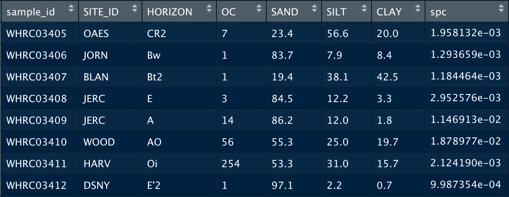
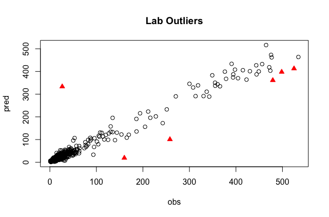

# Data Preprocessing

* Data Preprocessing must be performed for the **reference set**, used to create the models, as well as the dataset you are making predictions from, the **prediction set**
* The prediction set and reference set will be the same dataset if you are just using a **single spectral library**, but can be different if you are using models from one set to make predictions on another.
* Data preprocesing is executed by the functions within `preprocess_functions.R`    
* The code shown below is the section of the [demo script](https://whrc.github.io/Soil-Predictions-MIR/getting-started.html#demo-script) which calls the preprocessing functions to preprocess the reference set.     
* The following subsections in this guide explain the steps and their respective functions in more detail    

```{r, eval=FALSE}
#----------------------------------------------#
# Data Preprocessing #
#----------------------------------------------#
source("Functions/preprocess_functions.R")

# Get Spectral Library Set
ALL_data <- getSpecLib(SAVENAME="ALL_data")

# Refine Spectral Library
OC_data <- refineSpecLib(SPECLIB=ALL_data, PROP="OC", CALVAL=TRUE, SAVENAME="OC_data")

# Define Reference and Prediction Sets
#load("Data_Processed/OC_data.RData")
refSet <- OC_data[OC_data$calib==1,]
predSet <- OC_data[OC_data$calib==0,]
```

## Get Spectral Library   {-}

A **spectral library** is simply a dataset containing spectral data for various samples. For the purpose of training models, it is also necessary to have corresponding lab data for the soil properties you are interested in predicting. `getSpecLib()` is a wrapper function that takes a folder of OPUS files containing spectral data, and a 'csv' of lab data, and outputs a merged file with all the spectral and lab data for each sample.

### `getSpecLib()` {-}
     

* `getSpecLib( SPECPATH, LABPATH, SAVENAME )`     
    + `SPECPATH`: *string*- The path to the folder of opus files, from within the 'Soil-Predictions-Example' folder. Default set to "/Data_Raw/SPECTRA"
    + `LABPATH`: *string*- The path to the 'csv' of lab data. This file must include a sample_id column first, followed by the column(s) of lab data for the soil properties of interest. sample_id will be used to merge the spectra to its corresponding lab data
    + `SAVENAME`: *string*- The name you would like to save the spectral file after processing. The default is set to "none" which will not save a file.

```{r}
getSpecLib <- function(SPECPATH="/Data_Raw/SPECTRA", 
                       LABPATH="Data_Raw/LAB_DATA.csv", SAVENAME="none"){
  # Extract OPUS Files
  spectra <- opus_to_dataset(SPECPATH)
  
  # Subset Spectral Range
  spectra$spc <- subset_spectral_range(spectra$spc)
  
  # Where calibration transfer would occur
  
  # Baseline Transformation
  spectra$spc <- base_offset(spectra$spc)
  
  # Merge with Lab Data
  lab <- data.frame(read.csv(LABPATH))
  speclib <- merge(lab, spectra, all.y=TRUE)
  
  # Optional Save after Processing
  if(SAVENAME!= "none"){
    assign(SAVENAME,speclib)
    speclib <- get(SAVENAME)
    if(file.exists("./Data_Processed")==FALSE){dir.create("./Data_Processed")}
    savepath <- paste0("Data_Processed/",SAVENAME,".RData")
    save(speclib, file=savepath)
    write.csv(speclib, savepath, row.names=FALSE)
  }
  return(speclib)
}
```

  

### Extract Spectra {-}

For Bruker Instruments, an **OPUS file** containing spectral data, will be output for each sample that is scanned. To compile these separate files into one dataset, we use a couple functions from the `simplerspc` package by Philip Baumann, as well as the `stringr` and `foreach` packages.     

#### `opus_to_dataset()` {-}

     

* `opus_to_dataset( SPECPATH, NWAVE, SAVENAME )`     
    + `SPECPATH`: *string*- The path to the folder of opus files, from within the 'Soil-Predictions-Example' folder. Default set to "/Data_Raw/SPECTRA"
    + `NWAVE`: *integer*- The number of wavelengths to extract. This will be set on the FTIR before running. The default is set to 3017, which we use at WHRC
    + `SAVENAME`: *string*- The name you would like to save the spectral file after processing. The default is set to "none" which will not save a file.
_  

Load appropriate packages for `opus_to_dataset()`...
```{r eval=FALSE}
#---Packages---#
library(stringr) #used for str_sub
library(foreach) #used within read-opus-universal.R
source("Functions/gather-spc.R") #simplerspec function
source("Functions/read-opus-universal.R") #simplerspec function
```


Get the paths of all OPUS files...
```{r, eval=FALSE}
#---List Files---#
spectraPath <- "/Data_Raw/ref-SPECTRA" #folder of OPUS files
dirs <- list.dirs(paste(getwd(),spectraPath,sep=""), full.names=TRUE)
all.files <- list.files(dirs, pattern= "*.0", recursive=TRUE,full.names=TRUE)
```
A single path will look something like this:    `/Soil-Predictions-Example/Data_Raw/ref-SPECTRA/WHRC03405_S_001_030.0`    

Extract the spectra and gathers it into a tibble data frame...
```{r eval=FALSE}
#---Extract Spectra---#
spc_list <- read_opus_univ(fnames = all.files, extract = c("spc"))
soilspec_tbl <- spc_list %>%
  gather_spc()
spc <- soilspec_tbl$spc
```

Truncate the dataset to the number of wavelengths specified, to ensure the spectra from different samples align...
```{r eval=FALSE}
#---Truncate Spectra---#
  spc.trun <- lapply(1:length(spc),function(x) spc[[x]][,1:NWAVE]) # Truncate at 3017 by default
```

Process spectra into a dataframe and 
```{r eval=FALSE}
#---Process to Dataframe---#
spc.df <- as.data.frame(matrix(unlist(spc), nrow=length(spc), byrow=T))
colnames(spc.df) <- colnames(spc[[1]])
rownames(spc.df) <- as.character(seq(1,nrow(spc.df)))
```

Assign a `sample_id` based off the file names ^[sample_ids that are numeric may cause issues while merging so a string ID is advised]...    
```{r, eval=FALSE}
#---Assign sample_ids---#
spc.df <- data.frame(sample_id = soilspec_tbl$sample_id, spc.df)
spc.df$sample_id <- str_sub(spc.df$sample_id,1,9)
```

Reformat the dataframe to have all the spectra as a matrix column...
```{r, eval=FALSE}
#---Reformat w/ Spectral Matrix Column---#
spectra <- data.frame(spc.df[,1])
spectra$spc <- as.matrix(spc.df[,2:ncol(spc.df)])
colnames(spectra) <- c("sample_id", "spc")
```

Optionally save the spectra as an R dataset and csv file if `SAVENAME` is passed...
```{r eval=FALSE}
#---Optionally Saves---#
if(SAVENAME != "none"){
  assign(SAVENAME, spectra)
  savefile <- paste0("Data_Processed/", SAVENAME, ".RData")
  save(list= SAVENAME, file= savefile)
  print(SAVENAME,"saved to", savefile)
}
```

### Process Spectra {-}

#### Subset Spectral Range {-}
To yield the best predictions, we exclude areas of the spectral range that may be problematic. The following function narrows down the regions of the spectra by truncating wavenumbers below 628 and between 2268 to 2389, which is a CO2 sensitive region

#### `subset_spectral_range()` {-}
    

* `subset_spectral_range( SPECTRA )`    
    + `SPECTRA`: *matrix*- A matrix of spectral data

```{r eval=FALSE}
#---Edit Spectral Columns---#
col.names <- colnames(spectra$spc) #get column names which are wavenumbers
col.names <- as.numeric(substring(col.names,2))

cutoff <- which(col.names <= 628)[1]
spectra$spc <- spectra$spc[,-c(cutoff:length(col.names))] #truncate at >= 628

min.index <- which(col.names <= 2389)[1]
max.index <- which(col.names <= 2268)[1]
spectra$spc <- spectra$spc[,-c(min.index:max.index)] #remove CO2 region
```

#### Baseline Transformation {-}
We can perform a baseline transformation to normalize the spectra, by subtracting the minimum values for each row/sample.

#### `base_offset()` {-}
     

* `base_offset(x)`
    + `x`: a matrix


```{r eval=FALSE}
library(matrixStats) # Used for rowMins() function
base_offset <- function(x){
  row_mins <- rowMins(x)
  return(x-row_mins) # Subtracts row_mins
}
```

<!--could show head of the spectra, or a figure showing the dimensions-->
#### Other Transformations {-}
* Standard Normal Variate
* First Derivative

#### (Calibration Transfer) {-}
{Optional}
Recommended when the spectral library of samples to be predicted was scanned by a different instrument than the samples used to built the model.
For example, you would want to perform a calibration transfer on the prediction set, if you were using the KSSL library to make predictions on samples scanned at Woods Hole Research Center.


### Merge with Lab Data {-}
If there is lab data associated with your soil samples, this can be merged with the spectral data and later used to assess the performance of your models. The example lab dataset below provides information about where the soil sample was taken with the Site_ID and Horizon, as well as the lab measurements for various soil properties including Organic Carbon, Sand, Silt and Clay.

<!--discuss FTIR run-lists and associating IDs -->
```{r eval=FALSE}
#---Read Lab Data---#
lab <- data.frame(read.csv("Data_Raw/LAB_DATA.csv"))
```
            
            
The merge() command joins the lab dataset to the spectral dataset. The all.y=TRUE parameter indicates that the final dataset will contain all the rows of spectra. This means that if some samples do not have lab data, they will be assigned a value of NA but the spectra will remain in the set. 
```{r eval=FALSE}
#---Merge with Spectra---#
lab <- data.frame(read.csv(LABPATH))
speclib <- merge(lab, spectra, all.y=TRUE)
```

Optionally save the spectra as an R dataset and csv file if `SAVENAME` is passed within getSpecLib()...
```{r, eval=FALSE}
#---Optionally Saves---#
if(SAVENAME!= "none"){
  assign(SAVENAME,speclib)
  speclib <- get(SAVENAME)
  if(file.exists("./Data_Processed")==FALSE){dir.create("./Data_Processed")}
  savepath <- paste0("Data_Processed/",SAVENAME,".RData")
  save(speclib, file=savepath)
}
```
The final dataframe contains a unique ID, lab data, and a matrix of spectral data called 'spc'. It is suggested to save this file as RData so it may be reloaded as needed.    

## Refine Spectral Library {-}

You may want to refine the samples you use to build your model or predict off of by...     

* Subsetting the set to 15000 samples if it is large
* Eliminating samples with NA, negative, or outlier lab data      
* Spliting the set or property subsets into calibration and validation groups   

### `refineSpecLib()` {-}

* `refineSpecLib( SPECLIB, PROP, OUTLIER, LARGE, CALVAL, SAVENAME )`     
    + `SPECLIB`: *dataframe*- A dataframe object containing a sample_id column, a matrix of spectral data as column spc, and lab data columns if you intend to use the PROP parameter.
    + `PROP`: *string*- The column name of the soil property of interest. If this is passed, the set will be refined using this lab data. Default is set to NA.
    + `OUTLIER`: *vector*- A vector containing the outlier removal methods you would like applied to the data. Default is c("stdev") which detects lab data outliers. It can also be set to c("fratio") to detect spectral outliers, both c("stdev", "fratio"), or neither c("none")
    + `LARGE`: *boolean*- Set to TRUE if you have a large dataset you would like to subset. Default is FALSE.
    + `CALVAL`: *boolean*- Set to TRUE if you would like to create calibration and validation sets. It will return the dataset with a column, calib, that is assigned 1 for samples in the calibration set and 0 for those in the validation set. 80/20 split. Default is set to FALSE. 
    + `SAVENAME`: *string*- The name you would like to save the spectral file after processing. The default is set to "none" which will not save a file.

```{r, eval=FALSE}
# Load outlier functions
source("Functions/outlier_functions.R")

refineSpecLib <- function(SPECLIB, PROP=NA, OUTLIER=c("stdev"), LARGE=FALSE, 
                          CALVAL=FALSE, SAVENAME="none"){
  
  # Remove rows with faulty lab data
  if(!is.na(PROP)){
    SPECLIB  <- noNA(SPECLIB , PROP) # Remove NAs
    SPECLIB  <- noNeg(SPECLIB , PROP) # Remove Negative
    if("stdev" %in% OUTLIER){
      SPECLIB  <- SPECLIB[-stdev_outliers(SPECLIB,PROP),] # Remove lab data outliers
    } 
  }
  
  # Remove spectral outliers
  if(!("fratio" %in% OUTLIER)){
    #SPECLIB  <- SPECLIB[-fratio_outliers(SPECLIB),] # Identified with fratio
  } 
  
  # Subset a large dataset to 15000
  if(LARGE==TRUE){
    SPECLIB$spc <- sub_large_set(SPECLIB) # Subset to 15000 samples
  }
  
  # Split calibration/validation sets
  if(CALVAL==TRUE){
    SPECLIB <- calValSplit(SPECLIB)
  }
  
  # Save the refined reference set for OC
  if(SAVENAME != "none"){
    if(file.exists("./Data_Processed")==FALSE){dir.create("./Data_Processed")}
    assign(SAVENAME, SPECLIB)
    savefile <- paste0("Data_Processed/", SAVENAME, ".RData")
    save(list= SAVENAME, file= savefile)
    print(SAVENAME,"saved to", savefile)
  }
  return(SPECLIB)
}
```

### Large Sets {-}
If you reference set exceeds 15000 samples, you may chose to subset it. We have found that 15000 is optimal for speed and performance of the models, when the reference set is very large. This subset can be performed using **conditional latin hypercube sampling**, with the `clhs` package. 

#### `sub_large_set()` {-}  

* `sub_large_set( SPECLIB, SUBCOUNT)`
    + `SPECLIB`: *dataframe*- Dataframe including spectral data as a matrix 'spc'
    + `SUBCOUNT`: *integer*- Number of samples to subset. Default is set to 15000    
    
```{r, eval=FALSE}
library(clhs)
sub_large_set <- function(SPECLIB, SUBCOUNT=15000){
  spectra <- data.frame(SPECLIB$spc)
  subset <- clhs(spectra, size = SUBCOUNT, progress = TRUE, iter = 500)
  SPECLIB <- SPECLIB[subset,] #double check
  return(SPECLIB)
}
```

### Faulty Lab Data {-}
To yield the best models, we can exclude rows with faulty lab data (NA, negative, and outlier values). This may vary by soil property, so the process should be repeated for each property.     

#### `noNA()` {-}


* `noNA( dataset, column )`
    + `dataset`: dataframe to eliminate NAs from
    + `column`: column to check for NA values   
    
Gets rid of NA values...
```{r, eval=FALSE}
noNA <- function(dataset, column){
  return(dataset[!is.na(dataset[,column]),])
}
```

#### `noNeg()` {-}

* `noNeg( dataset, column )`
    + `dataset`: dataframe to eliminate negative values from
    + `column`: column to check for negative values   

Gets rid of Negative values...
```{r, eval=FALSE}
noNeg <- function(dataset, column){
  return(dataset[which(dataset[,column] > 0),])
}
```

### Outliers {-}
We can identify both outliers in the lab data and outliers in the spectral data, to optimize our models. The following functions are called based on the variable `OUTLIER` passed in `refineSpecLib()`. They are stored in `outlier_functions.R`    

#### Lab Data Outliers {-}    
This outlier detection approach creates a PLS model, regresses the predictions against the lab data, and identifies the 1% of samples that were farthest from the line of best fit. These samples will be printed out in the consol and highlighted on a plot like the one below. In this case, the sample size is about 600, so 6 outliers were identified.    




#### `stdev_outliers()` {-}  
    
* `stdev_outliers( SPECLIB, PROP, SHOW, PLOT )`
    + `SPECLIB`: *dataframe* A dataframe to eliminate standard deviation outliers from
    + `PROP`: *string* A column to check for standard deviation outliers 
    + `SHOW`: *boolean* Whether or not to show results. Default is TRUE.
    + `PLOT`: *boolean* Whether or not to plot results. Default is TRUE.
    
``` {r, eval=FALSE}
stdev_outliers <- function(SPECLIB, PROP, SHOW=TRUE, PLOT=TRUE){

  # Create a PLS model with the data
  pls.fit <- plsr(sqrt(get(PROP))~spc, ncomp= 20, data = SPECLIB, valid="CV", segments = 50) #y, x, number components, data, cross validation,
  pred <- c(predict(pls.fit, newdata = SPECLIB$spc,ncomp=20))^2

  # Identify outliers using a standard deviation threshold
  sd.outlier <- optimum_sd_outlier(pred, SPECLIB[,PROP], seq(0.1,3, by =0.02))
  outliers <- outlier_indices(pred, SPECLIB[,PROP], sd.outlier[1])

  # Display outlier identification
  if(SHOW==TRUE){

    # Show outlier prediction versus observed values
    predobs <- data.frame(pred, SPECLIB[,PROP])
    names(predobs) <- c("pred", "obs")
    print(predobs[outliers,])

    # Plot with Outliers
    plot(pred ~ obs, data=predobs[-outliers,], main="Lab Outliers")
    points(pred ~ obs, data=predobs[outliers,], col="red", pch=24, bg="red")

  }
  return(outliers)
}
```

#### Spectral Outliers {-}
There may also be outliers in the spectral data, which we can detect and remove. Eliminating them from the **reference set** may build a stronger model, so this can be performed in the preprocessing stage. For the **prediction set**, you may want to see where the prediction samples lie within the reference set as well. Is the reference set data representative of the prediction set samples? If they fall to far outside of the reference set space, you might decide it is not appropriate to make predictions for these samples.   

To detect spectral outliers, we can look at the spectra in **principal component space** and identify which samples are farthest from the center of the data. We use a statistic called the **fratio**, to measure this variation. Using the scores and loadings from principal component analysis, we get predictions of the spectra, which can be compared to the actual values of the spectra. Looking at the probability distribution of the residuals with the fratio, we can flag samples that vary significantly from their predicted values.

The 3D plot below shows an example of spectral outliers being detected in the principal component space of PC1, PC2 and PC3:    


#### `fratio_outliers()` {-}

* `fratio_outliers( SPECLIB, P, SHOW, PLOT )`
    + `SPECLIB`: *dataframe*- A dataframe to eliminate standard deviation outliers from. Must include spectral matrix as 'spc' column.
    + `P`: *double*- A fraction signifying the threshold to be used for detecting outliers. Default is set to 0.99 
    + `SHOW`: *boolean*- Whether or not to show results. Default is TRUE.
    + `PLOT`: *boolean*- Whether or not to plot results. Default is TRUE.

```{r, eval=FALSE}
library(plot3D) # For 3D plot
fratio_outliers <- function(SPECLIB, P=0.99, SHOW=TRUE, PLOT=TRUE){
  
  # Get Principle Component Analysis
  pca <- prcomp(SPECLIB$spc)
  # Get Scores
  scores <- pca$x
  # Get Loadings
  loadings <- pca$rotation
  # Get Predicted Spectra
  pred_spc <- scores %*% t(loadings) 
  # Scale Spectra
  spc <- scale(SPECLIB$spc,scale=FALSE)
  # Get Residuals
  res <- (pred_spc - spc)^2
  res <- sqrt(rowSums(res))
  # Get Fratio
  for(i in 1:length(res)){
    sample.fratio <- (length(res)-1) * res^2/sum((res[-i])^2)
  }
  # Get Samples that Exceed the Threshold, P
  ok <- pf(sample.fratio, 1, length(res)) 
  outliers <- which(ok>P)
  
  # Display Results
  if(length(outliers)>0){ # If there are spectral outliers
    if(PLOT==TRUE){
      # 3D Plot
      x <- pc1 <- scores[,1]
      y <- pc2 <- scores[,2]
      z <- pc3 <- scores[,3]
      scatter3D(x,y,z, col="black", cex = 0.5)
      points3D(x[outliers], y[outliers], z[outliers], col="red", pch=16, add=TRUE)
    }
    if(SHOW==TRUE){
      # Print Outliers
      print("Spectral Outliers")
      print(data.frame(sample_id=SPECLIB[outliers,1], PF=round(ok[outliers],6)))
    }
    return(outliers)
  }else{
    print("No Spectral Outliers")
  }
}
```


<!--Insert plot showing the outlier selection process-->

### Cal/Val Groups {-}

You may chose to subset a portion of the reference set as a calibration group which will be used to build the models- leaving the remaining samples as the validation set to test the model. **Kennard Stone** is a method for performing this type of separation while ensuring each group is representative of the set. The following function returns the spectral library with an additional column, 'calib', signifying whether or not the sample is in the calibration set. This is used in the [demo script](https://whrc.github.io/Soil-Predictions-MIR/getting-started.html#demo-script) to define the reference set and prediction set:    
```{r,eval=FALSE}
refSet <- OC_data[OC_data$calib==1,]
predSet <- OC_data[OC_data$calib==0,]
```

#### `calValSplit()` {-}

* `calValSplit( SPECLIB, FRAC )`
    + `SPECLIB`: *dataframe*- The dataset containing a spectral matrix as column spc. 
    + `FRAC`: *double*- The fraction of data to be allocated to the calibration set. The default is 0.8 or 80%.

```{r, eval=FALSE}  
library(prospectr)
calValSplit <- function(dataset){
  #perform kennard stone to separate data into 80% calibration and 20% validation sets
  ken_stone<- prospectr::kenStone(X = dataset$spc, 
                                  k = as.integer(0.8*nrow(dataset)), 
                                  metric = "mahal", pc = 10)
  calib <- dataset[ken_stone$model, ]
  valid <- dataset[ken_stone$test, ]
  
  return(c(calib, valid))
}
```

