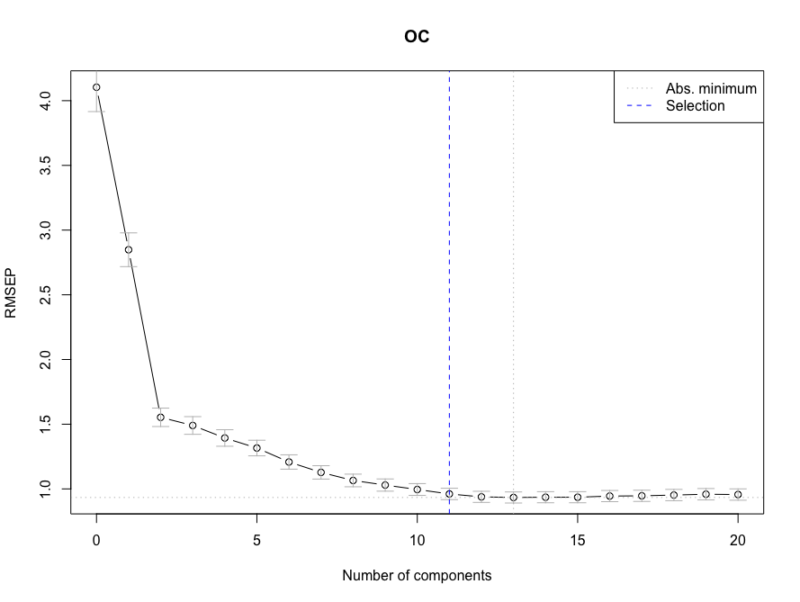

# PLSR Models
This section of the [demo script](https://whrc.github.io/Soil-Predictions-MIR/getting-started.html#demo-script) creates PLSR models and gets predictions from them:    
```{r, eval=FALSE}
#----------------------------------------------#
# Partial Least Squares Regression #
#----------------------------------------------#
source("Functions/plsr_functions.R")
source("Functions/perform_functions.R")

# Make Model
plsr.OC <- makePLSModel(PROP="OC", REFNAME="refSet")

# Make Predictions
pls.predictions <- getModResults(PROP="OC", MODTYPE="PLS", MODNAME= "plsr.OC", PREDNAME= "predSet")
```

## Model Theory {-}
* **Partial Least Squares Regression** (PLSR) is a useful technique for making predictions on high dimensional datasets; Those with many columns or predictor variables relative to the number of rows or instances.     
    + For example, we are using **2720 columns** of spectral data as predictor variables for only **478 rows** of samples in the script to follow. This could cause major issues of overfitting with a simple regression and there may be a lot of redundancy in the data.    
    
* PLSR models, like Principal Component Analysis (PCA), **reduce the dimensionality** of the dataset by creating a new set of orthogonal variables that explain the most variation in the data called principal components.
    + Scores: Scores are the location (or distance from origin) of each sample along each principal component. Represented by U in the diagram below.
    + Loadings: Loadings are the weights of each of the original variables (wavenumbers) used to calculate each principal component. Represented by V in the diagram below.
    
  ^[http://www.statistics4u.com/fundstat_eng/cc_pca_loadscore.html]

* However, instead of **optimizing covariance** amoung only the predictor variables, in this case the spectra, PLS optimizes covariance between the predictors and the response variable, the soil property of interest.    
    + To learn more about PLS, check out this youtube video: [**PLS Introductory Video**]("https://www.youtube.com/watch?v=AxmqUKYeD-U")    

<!-- These come in the form of scores and loadings {explain contrast with PCA} -->   
<!--vocab: orthogonal, high dimensional, latent variables- have links to define orthogonal-->

## Making PLSR Models {-}
The following is a wrapper function for loading the appropriate data, assigning a validation type, making a PLS model and optionally saving it. It is stored in `Functions/plsr_functions.R` and used directly in the [demo script](https://whrc.github.io/Soil-Predictions-MIR/getting-started.html#demo-script):  

```{r, eval=FALSE}
source("Functions/plsr_functions.R")
# Make Model
plsr.OC <- makePLSModel(PROP="OC", REFNAME="refSet")
```


### `makePLSModel()` {-}

* `makePLSModel( PROP, REFNAME, REFPATH, VAL_TYPE, SAVENAME )`
    + `PROP`: *string*- The column name of soil property of interest in your reference set
    + `REFNAME`: *string*- The name of the reference set variable, if it is already loaded into the R environment, that will be used to create the model. Use REFNAME or REFPATH
    + `REFPATH`: *string*- The path the the RData file containing your reference set, if the reference set is not already loaded. Use REFNAME or REFPATH
    + `VALTYPE`: *string*- {Optional} The validation method, either "LOO", CV", or "none". The default is set to "CV"
    + `SAVENAME`: *string*- {Optional} The name you would like to save the spectral file after processing. The default is set to `paste0("plsr.",PROP)` which would save the file "plsr.OC.RData", for example
    
_

* We use the [pls package in r...](https://cran.r-project.org/web/packages/pls/vignettes/pls-manual.pdf)    

```{r eval=FALSE}
#---Packages---#
library(pls)
```

* If `REFPATH` is not NA, it will load the reference set at the path passed. Otherwise, it assumes you have passed in `REFNAME`, the variable name of a reference set already loaded. We use the `get()` command, rather than the variable itself, so that the name of the variable can be saved with our prediction performance.    

```{r, eval=FALSE}
# Load Data
if(!is.na(REFPATH)){
  REFNAME <- load(REFPATH) # If REFPATH is given
}
refset <- get(REFNAME) # load as variable REFSET
```

* The `plsr()` command creates a model based on several inputs, outlined in the 
full [**plsr() documentation**](https://www.rdocumentation.org/packages/pls/versions/2.7-2/topics/mvr) and [**pls manual**](https://cran.r-project.org/web/packages/pls/pls.pdf)

* Used in this example we have...
    + `Y` The lab data/ observed data for the soil property you are trying to predict. We chose to square root transform this variable to normalize the data. Predictions made my the model are squared to back transform them.  
    + `X` A matrix of spectra with the same number of rows as Y  
    + `ncomp` The number of components that you would like to include in the model  
    + `data` The dataset containing Y and X  
    + `valid` The preferred validation type ("LOO","CV","none") 
        + `LOO` for leave-one out
        + `CV` for cross validation
        + `none` if you chose not to include validation     
        
```{r,eval=FALSE}
# Create Model
model <- plsr(sqrt(get(PROP))~spc, ncomp=20, data = refset , valid=VALTYPE)
```

* Optionally save the model. By default it will save to the Models folder as plsr.PROP -> Ex: 'Models/plsr.OC.RData'    

```{r,eval=FALSE}
# Save Model
if(SAVENAME != "none"){
  if(file.exists("./Models")==FALSE){dir.create("./Models")} # Create Folder to Save Models
  assign(SAVENAME, model)
  savefile <- paste0("Models/",SAVENAME,".RData")
  save(list= SAVENAME, file = savefile) #Ex: plsr.OC.RData
  print(paste("Model saved to",savefile))
}
return(model)
```

## Getting PLS Predictions {-}
The following is a function for getting PLS predictions stored in `Functions/plsr_functions.R` In the [demo script](https://whrc.github.io/Soil-Predictions-MIR/getting-started.html#demo-script) is it called within `getModResults()` which is stored in `Functions/perform_functions.R`. 

```{r, eval=FALSE}
pls.predictions <- getModResults(PROP="OC", MODTYPE="PLS", MODNAME= "plsr.OC", PREDNAME= "predSet")
```

### `getPredPLS()` {-}
There are a few different ways of getting predictions from a pls model. Stored within the pls object itself, are the validation predictions and fitted predictions for the reference set used to build the model. However, you can also apply the model on a new dataset using the `predict()` function in the pls package.    

* `getPredPLS( MODEL, NCOMP, PREDTYPE, PREDSET )`
    + `MODEL`: *object*- pls model object to get predictions from
    + `NCOMP`: *integer*- Number of components of the model to use for getting predictions. Default is set to `ncompOneSigma()`
    + `PREDTYPE`: *string*- The prediction method, "fitted" returns the predictions for the reference set, "valid" returns the validation predictions for the reference set, and "predict" will return predictions from applying the model on another dataset, PREDSET.       
    + `PREDSET`: *dataframe*- A dataframe to apply the model on to make predictions. Must have a 'spc' column containing a matrix of spectral data with the same number of columns as the reference set used to build the original model.    
_

* If the prediction type is "valid", we extract the validation predictions for the reference set, made when creating the model. These are stored within the model object at `MODEL$validation$pred`
```{r, eval=FALSE}
if(PREDTYPE=="valid"){
  sqrt_pred <- unlist(data.frame(MODEL$validation$pred)[NCOMP])
}
```

* If the prediction type is "fitted", we extract the predictions from the reference set. These are the fitted values of the reference set to the model and are stored within the model at `MODEL$fitted.values`
```{r, eval=FALSE}
if(PREDTYPE == "fitted"){
  sqrt_pred <- unlist(data.frame(MODEL$fitted.values)[NCOMP])
}
```

* If the prediction type is "predict", we make predictions with off of the spectra in our prediction set. 
```{r, eval=FALSE}
if(PREDTYPE == "predict"){
  sqrt_pred <- c(predict(MODEL, newdata = PREDSET$spc, ncomp=NCOMP))
}
```

* Since we square root transformed the input lab data, we actually predicted for the square root of our property of interest. Here we square the predictions to untransform this data.    
```{r, eval=FALSE}
predictions <- c(sqrt_pred^2)
names(predictions) <- c(seq(1:length(predictions)))
return(predictions)
```

### `ncompOneSigma()` {-} 
This function selects the optimal number of components to use for getting pls predictions from the model.    

* `ncompOneSigma( MODEL )`
    + `MODEL`: A PLS model object   
    
    
```{r, eval=FALSE}
ncompOneSigma <- function(MODEL){
  ncomp <- selectNcomp(MODEL, method = "onesigma", plot = TRUE, ylim = c(0, 50))
  return(ncomp)
}
```

The scree plot below shows how much the RMSEP decreases, with each additional component added. As you can see, the marginal improvements to the model eventually level off, and the addition of more components is not necessary for better predictions. With the method "onesigma", the optimal number of components is selected as the first model where the RMSEP is within 1 standard error of the absolute optimal RMSEP.   


<!-- #----------------Optional Functions------------------#

# Get Sample ID

getSampleID <- function(PROPERTY, PREDTYPE, PREDSET=NULL, REFSET=NULL){
  if(PREDTYPE == "predict"){
    sample_id <- data.frame(PREDSET$sample_id)
  }
  else{ # If predtype is "valid" or "fitted"
    sample_id <- data.frame(REFSET$sample_id)
  }
  names(sample_id) <- c("sample_id")
  return(sample_id)
}


# Get Lab Data

getLabPLS<- function(MODEL, PREDTYPE="fitted", PREDSET=NULL, PROP=NULL){

  # Extract Lab Data
  if(PREDTYPE=="predict"){
    lab_data <- c(PREDSET[,PROP])
  }else{
    Y_name <- names(MODEL$model)[1]
    print(Y_name)
    sqrt_lab <- eval(parse( text=paste0("MODEL$model$`", Y_name,"`")))
    #lab_data <- data.frame(MODEL$model$`sqrt(get(property))`^2)
    lab_data <- c(sqrt_lab)^2
  }

  return(lab_data)
}


# Get PLS Model Coefficients

getPLSCoefs <- function(MODEL, PROP, NCOMP){
  beta_coeff <- data.frame(MODEL$coefficients)[NCOMP]
  return(beta_coeff)
}
-->
