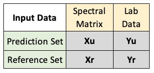
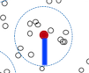

# MBL Models

## Model Theory

### Overview {-}
**Memory-Based Learning** (MBL) is a local modeling approach that can be used to predict a given soil property from a set of spectral data, the **prediction set**.    

Like PLS, this approach relies on a **reference set**, containing both spectral data and known values for the soil property of interest (ie. Organic Carbon).     

While PLS create a single **global model** which can be applied to all samples in the prediction set, MBL makes a **local model** for each prediction.     

Local models are built from a sample's **nearest neighbors**: samples in the reference set that are most similar to the sample being predicted.

Similarity is measured by **spectral similarity**, which should reflect similarities in soil composition. Since each sample has a customized model, predictions are often **more accurate** than PLS predictions.

However, MBL models can be quite **computationally intensive** since           
1) A model is built for each sample being predicted     
2) All samples in the prediction and reference set must be related in terms of similarity

### Animation {-}
The animation below illustrates how local modeling works in MBL. It is shown in multidimensional space since each spectral column is a dimension of the dataset.

```{r, echo=FALSE}
knitr::include_graphics(path="./images/mbl_vid.gif")
```

**A** Shows all the samples in the prediction set (red), overlaying all the samples in the reference set (gray)             
**B** Shows a circle indicating the nearest neighbors of a sample being predicted       

**C** Shows all the samples of the prediction set with their respective nearest neighbors     

**D** Shows how local models will be created for each prediction from these nearest neighbors    

Resemble Powerpoint: http://www.fao.org/fileadmin/user_upload/GSP/docs/Spectroscopy_dec13/SSW2013_f.pdf


## Making MBL Predictions

### MBL Functions {-}
Full documentation on the mbl() function of the resemble package can be found below, or by typing ??resemble in r:     
MBL- https://www.rdocumentation.org/packages/resemble/versions/1.2.2/topics/mbl     
```
mbl(Yr, Xr, Yu = NULL, Xu,    
    mblCtrl = mblControl(),      
    dissimilarityM,     
    group = NULL,     
    dissUsage = "predictors",      
    k, k.diss, k.range,     
    method,      
    pls.c, pls.max.iter = 1, pls.tol = 1e-6,     
    noise.v = 0.001,     
    ...)
```
MBL Control- https://www.rdocumentation.org/packages/resemble/versions/1.2.2/topics/mblControl  
```
mblControl(sm = "pc",
           pcSelection = list("opc", 40),
           pcMethod = "svd",
           ws = if(sm == "movcor") 41,
           k0,
           returnDiss = FALSE,
           center = TRUE,
           scaled = TRUE,
           valMethod = c("NNv", "loc_crossval"),
           localOptimization = TRUE,
           resampling = 10, 
           p = 0.75,
           range.pred.lim = TRUE,
           progress = TRUE,
           cores = 1,            
           allowParallel = TRUE)
```

### Modeling Parameters {-}
This section explains some of the main ways to customize and optimize mbl models using `mbl()` in the resemble package. Below is an example workflow for modeling with MBL:     

   

#### Input Datasets {-}
* The `mbl()` function accepts 4 different data products, `Xu` `Xr` `Yu` and `Yr`, summarized in the table below:    
    
* Both ***X***s are matrices with spectral data and both ***Y***s are vectors with lab data for the property of interest.   
* ***u*** indicates "uncertain" for our prediction set, and ***r*** indicates "reference" for our reference set.   
* `Yu` is optional, since not all prediction sets will have associated lab data. If this is the case, set `Yu` to `NULL`.
* See the data preprocessing tab to prepare these datasets prior to modeling. In addition, it is necessary to remove all rows in the reference set inputs (`Yr` and `Xr`) that have `NA` values. If you would like to include `Yu` but there are missing values, you must also remove those rows in both prediction set inputs (`Yu` and `Xu`).    
    + Number of columns in `Xr` must equal that of `Xu`.
    + Number of rows in `Yr` must equal that of `Yu`, if provided.

#### Matrix of Spectral Neighbors {-}    
* When selecting nearest neighbors to build a local model, the `mbl()` function references a **spectral dissimilarity matrix**, which relates samples in the prediction and reference sets.

* This matrix can be created by setting the `sm` parameter in `mblControl()`, or can be passed into the `mbl()` function as `dissimilarityM` if a matrix has already been made.  

* For creating the matrix, you will have to decide **how spectral dissimilarity will be calculated** by setting a couple variables in mblControl():
    + `sm` can be set to a variety of different methods for measuring distance in a multidimensional space. We have used `"pls" "pc" "euclid" "cosine" "cor" and "movcor"`
    + `pcSelection` determines how the number of principal components will be chosen for calculating Mahalonobis dissimilarity (when sm = "pc", "loc.pc", "pls" or "loc.pls")
        + We have this set to the default options of `(opc,40)` meaning the optimal principal component method will be used and up to 40 components will be tested.  
.
* Lastly, you can specify **how the matrix will be used** within the local models, if at all, by setting the `dissUsage` parameter to `"weights" "predictors" or "none"`. 
    + If set to `"predictors"`, the column of the matrix which shows similarity to the sample being predicted, will be added as a predictor variable to build the local model.  
    + If set to `"weights"`, the neighbors are weighted based on dissimilarity/distance (those closer to the sample being predicted receive more weight in the model).  
.
* The **matrix format** will look like one of the following, depending on how it will be used...
    + A. All reference and prediction sets samples as rows and columns ("predictors")
         
    + B. Reference set samples as rows, prediction set samples as columns ("weights")     
          

#### Neighbor Selection {-}
* The `mbl()` function allows you to specify how many nearest neighbors will be used to build local models, by setting either `k`, or `k.diss` and `k.range`.   
    + Option 1: Set `k` to a sequence of numbers to test, for how many neighbors to include.
        + `seq(40, 40, by=20)` , would perform 1 iteration, using 40 nearest neighbors
        + `seq(40, 100, by=20)`, would perform 4 iterations, using 40, 60, 80 and 100 nearest neighbors
    + Option 2: 
        + Set a dissimilarity threshold `k.diss` that limits the distance to search for neighbors from a sample. You can think of it as the radius of the circles shown in the model theory animation.     
        
        + Set `k.range` to the minimum and maximum number of neighbors you want to include, within the `k.diss` distance. 

#### Modeling Method {-}
* Once neighbors are selected, MBL builds local models using the multivariate regression method specified with the variable `method` in the `mbl()` function.
    + `pls` for partial least squares regression
    + `wapls1` for weighted average pls
    + `gpr` for gaussian process with dot product covariance
* `pls.c` allows you to set the number of pls components to be used if either "pls" or "wasp1" is used.
    + A single number if `pls` is used
    + A vector containing the minimum and maximum number of components to be used

#### Validation Method {-}
* You can specify the validation method by setting the parameter `valMethod` within the `mblControl()` function.
    + `NNv` for leave-nearest-neighbour-out cross validation
    + `loc_crossval` for local leave group out cross validation
    + `none` If you chose not to validate the model. This will improve processing speed.
    
#### Other {-}
Should I include this section?  

* `center`   

* `scaled`
    
### Sample Code {-}
#### Define Input Data {-}
```{r eval=FALSE}
Xu <- predDat$spc
Yu <- sqrt(predDat[,property]) 
Yr <- sqrt(calib[,property])
Xr <- calib$spc

Xu <- Xu[!is.na(Yu),]
Yu <- Yu[!is.na(Yu)]
Xr <- Xr[!is.na(Yr),]
Yr <- Yr[!is.na(Yr)]
```

#### Example 1 {-}
```{r eval=FALSE}

ctrl <- mblControl(sm = 'pc', pcSelection = list('opc', 50),
                    valMethod = 'loc_crossval',center=TRUE,scale=FALSE,allowParallel=FALSE)
mbl.sqrt <- mbl(Yr = Yr, Xr = Xr, Yu = Yu, Xu = Xu, mblCtrl = ctrl, dissUsage = 'none',
                    k = seq(40, 100, by = 20),
                    method = 'pls', pls.c = 6)
    
predVals <- c(mbl.sqrt$results$Nearest_neighbours_40$pred)^2
```

#### Example 2 {-}
```{r eval=FALSE}

diss2test <- seq(0.3, 1, by=0.1)
kminmax <- c(10, nrow(calib$spc))
pls.f <- c(minpls=3, maxpls=20)
    
ctrl <- mblControl(sm = pls, pcSelection = list("opc", 50), valMethod = "NNv", 
                       returnDiss = TRUE, scaled = FALSE, center = TRUE)
    
mbl.sqrt <- mbl(Yr = Yr, Xr = Xr, Xu = Xu, mblCtrl = ctrl, dissUsage = "none", k.diss = diss2test, k.range = kminmax, pls.c = pls.f, method = "wapls1")
    
idx.best.ca <- which.min(mbl.sqrt$nnValStats$st.rmse)
best.kdiss.ca <- mbl.sqrt$nnValStats$k.diss[idx.best.ca]
    
predVals <- c(getPredictions(mbl.sqrt)[, idx.best.ca])^2

```
