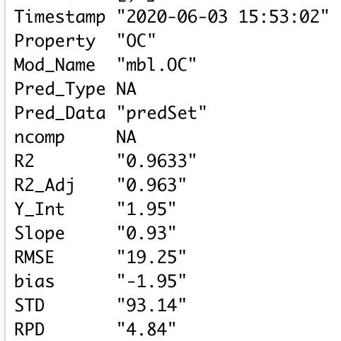
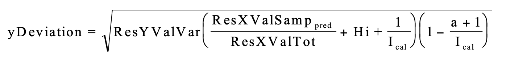

# Model Performance
The following section describes the function `getModResults()` which coordinates the steps after your pls or mbl model is created:    

1. Getting Predictions     

2. Calculating Uncertainty

2. Generating Summary Statistics   

3. Displaying Plots   


This allows us to assess the performance of the model. How close are the predictions to the observed lab data? If you do not have lab data to compare your predictions to, you should simply use the functions `getPredPLS()` and `getPredMBL()`

## Get Results {-}
The following function returns the results for either pls or mbl models, calling upon `getPredPLS()` and `getPredMBL()` functions, then generates summary statistics and a plot of the predictions against the observations.

### `getModResults()` {-}

* `getModResults()`
    + `PROP`: *string*- The column name of the soil property of interest. Ex: "OC"
    + `MODTYPE`: *string*- "MBL" or "PLS"
    + `MODNAME`: *string*- The name of the model variable, if it is already loaded into the R environment. Use MODNAME or MODPATH 
    + `MODPATH`: *string*- The path the the RData file containing your model, if the model is not already loaded. Use MODNAME or MODPATH
    + `PREDNAME`: *string*- The name of the prediction set variable, if it is already loaded into the R environment, that will be used to create the model. Use PREDNAME or PREDPATH
    + `PREDPATH`: *string*- The path the the RData file containing your prediction set, if the prediction set is not already loaded. PREDNAME or PREDPATH
    + `SAVEPRED`: *boolean*- Whether or not to save the predictions. If TRUE, predictions will be saved to the folder 'Predictions' using the function `savePredictions()`. Default is set to TRUE
    + `MODPERF`: *boolean*- Whether or not to generate and show the prediction performance statistics. If TRUE, these statistics will be generated by the `getModStats()` function, and saved in the folder 'Predictions' in the performance log.
    

```{r, eval=FALSE}
getModResults <- function(PROP, MODTYPE, MODNAME=NA, MODPATH=NA, PREDNAME=NA, PREDPATH=NA, SAVEPRED=TRUE, MODPERF=TRUE){
  
  # Load Model
  if(!is.na(MODPATH)){
    MODNAME <- load(MODPATH)
  }
  model <- get(MODNAME)
  
  # Load Prediction Set
  if(!is.na(PREDPATH)){
    PREDNAME <- load(PREDPATH)
  }
  predSet <- get(PREDNAME)
  
  # Extract Predictions
  if(MODTYPE=="MBL"){
    ncomp_onesigma <- NA
    pred_type <- NA
    predictions <- getPredMBL(model)
  }
  if(MODTYPE=="PLS"){
    # Find Optimal Number of Components
    ncomp_onesigma <- selectNcomp(model, method = "onesigma", plot=TRUE, main=PROP)
    # Get Predictions
    pred_type <- "predict"
    predictions <- getPredPLS(model, ncomp_onesigma, pred_type , predSet)
  }
  
  # Get Pred Versus Observations
  lab_data <- predSet[,PROP] # Lab Data
  predobs <- data.frame(predSet[,"sample_id"], predictions, lab_data)
  names(predobs) <- c("sample_id","pred","obs")
  
  # {Optional} Model Performance
  if(MODPERF==TRUE){
    modstats <- getModStats(PREDOBS= predobs, PROP=PROP, NCOMP=ncomp_onesigma, MODNAME=MODNAME, 
                            PREDTYPE= pred_type, PREDNAME=PREDNAME, SAVE=TRUE)
  }
  # {Optional} Save Predictions
  if(SAVEPRED==TRUE){
    savePredictions(predobs, PROP, MODTYPE, predSet, paste0(PREDNAME,"_predictions.csv"))
  }
  names(predobs) <- c("sample_id", paste0(PROP,".",MODTYPE), PROP)
  return(predobs)
}
```

## Predictions {-}
Predictions are extracting using either `getPredPLS()` or `getPredMBL()`. These are called within `getModResults()` before being saved. The following functions save predictions to a file unique to each prediction set. If this file already exists, it simply adds another column of predictions. If it does not, it will create the file to save predictions in from the original prediction set.    

### getSavePredTable() {-}
```{r, eval=FALSE}
getSavePredTable <- function(PREDSET, SAVENAME){
  
  if(file.exists("./Predictions")==FALSE){dir.create("./Predictions")}
  
  predSavePath <- paste0("./Predictions/", SAVENAME)
  if(file.exists(predSavePath) ){
    all_predictions <- read.csv(predSavePath)
  }else{
    all_predictions <- PREDSET[,-ncol(PREDSET)] # remove spectra, last column
  }
  
  return(all_predictions)
}

```

### savePredictions() {-}
```{r, eval=FALSE}
savePredictions <- function(PREDOBS, PROP, MODTYPE, PREDSET, SAVENAME){
  all_predictions <- getSavePredTable(PREDSET, SAVENAME) # Make/Load file to save predictions
  savename <- paste(PROP,MODTYPE,sep=".") # Ex: OC.PLSR column name
  
  if(!(savename %in% names(all_predictions))){
    
    all_predictions <- merge(all_predictions, PREDOBS[,1:2] , all.X=TRUE) # Merge with all_predictions
    ncolm <- ncol(all_predictions)
    names(all_predictions)[ncolm] <- savename
    savefile <- paste0("Predictions/", SAVENAME) # Set file savename
    write.csv(all_predictions, file=savefile, row.names=FALSE) # Save
    
    cat(paste("\nPredictions saved to", savefile)) # Print save location
    
  }else{
    cat("\nPrediction column already exists")
  }
  
  View(all_predictions)
}
```

## Statistics {-}
After making predictions using either of the modeling methods, various summary statistics can help test the accuracy of those predictions. The u-deviation, as a measure of uncertainty, can help assess how much each prediction can be trusted.    


### getModStats() {-}
The getModStats function returns the following statistics in a dataframe:    

* R2    
* R2 adjusted    
* Slope    
* Y-Intercept    
* RMSE    
* Bias    
* Standard deviation (of predictions)    
* Residual prediction deviation    

The minimum input is the PREDOBS table containing a column 'pred', containing the predictions and a column 'obs', its corresponding lab data. The remaining parameters are characteristics about the models and prediction runs that are important to include if you are saving the statistics.   

```{r, eval=FALSE}
getModStats <- function(PREDOBS, PROP=NA, NCOMP=NA, MODNAME=NA, PREDTYPE=NA, PREDNAME=NA, SAVE=FALSE){
  
  print(paste(PROP, "Summary"))
  TIME <- as.character(Sys.time()[1])
  
  # Regress predicted versus observed
  PREDOBS <- na.omit(PREDOBS)
  reg_mod <- lm(PREDOBS$pred ~ PREDOBS$obs)
  sum_perf <- summary(reg_mod)
  
  # Get statistics
  R2 <- round(sum_perf$r.squared,4)
  R2_adj <- round(sum_perf$adj.r.squared,4)
  b0 <- round(sum_perf$coefficients[1], 2) # Y-Intercept
  b1 <- round(sum_perf$coefficients[2],2) # Slope
  RMSE <- round(sqrt(mean((PREDOBS$pred - PREDOBS$obs)^2)),2)
  bias <- round((sum(PREDOBS$pred, na.rm=TRUE)- sum(PREDOBS$obs, na.rm=TRUE))/length(PREDOBS$obs),2)
  std <- round(sd(PREDOBS$pred, na.rm=TRUE),2) # Standard Deviation
  rpd <- round(std / RMSE,2) # Residual Prediction Deviation
  
  # Assemble Row
  modStats <- data.frame(Timestamp=TIME, Property=PROP, Mod_Name=MODNAME, Pred_Type=PREDTYPE,
                         Pred_Data=PREDNAME, ncomp=NCOMP, R2=R2, R2_Adj=R2_adj, Y_Int=b0, Slope=b1,
                         RMSE=RMSE, bias=bias,STD=std, RPD=rpd)
  
  # Write Row 
  if(SAVE==TRUE){saveModStats(modStats)}
  
  # Plot Pred Obs
  plot.plsr(PREDOBS$obs, PREDOBS$pred, modStats, paste(MODNAME,PREDNAME,"Predictions"), "")
  
  # Print Statistics
  print(t(modStats))
  
  return(modStats)
} # End of getModStats
```



### saveModStats() {-}
The following function will save the prediction statistics and information as a row in the performance log: `Predictions/prediction_performance.csv`   

```{r eval=FALSE}
saveModStats <- function(MODSTATS){
  
  if(file.exists("./Predictions")==FALSE){dir.create("./Predictions")}
  
  modStats_file <- "Predictions/prediction_performance.csv"
  if(file.exists(modStats_file)==FALSE){
    write.csv(MODSTATS, file = modStats_file, row.names=FALSE)
  }else{
    save_table <- read.csv(modStats_file)
    save_table <- rbind(save_table,MODSTATS)
    write.csv(save_table, modStats_file, row.names=FALSE)
  }
  print(paste("Statistics saved to", modStats_file))
}
```


### calcUDev() {-}    
We can calculate **uncertainty** for our predictions with the **u-deviation** which takes into account both differences in the spectra of the prediction and reference sets, as well as the prediction performance measured against observed values. The equation for the u-deviation is shown below and explained within 
[**The Unscrambler Method References**](https://www.camo.com/helpdocs/The_Unscrambler_Method_References.pdf)    

    

* **ResXValSamp**: The residual variance for the prediction set spectra. See getResXValSamp(). When this is higher, the udeviation is higher.

* **ResXValTot**: The average residual variance for the reference set spectra. See getResXValTot(). When this is higher, the udeviation is lower. 

* **ResYValVar**: The variance in predictions from their observed values using a cross validation method. When this is higher, the udeviation is higher.

* **Hi**: The leverage is the distance of how far samples in the prediction set are from those in the reference set. See getLeverage(). When this is higher, the udeviation is higher.    

* **Ical**: The number of samples in the calibration/reference set. When this is higher, the u-deviation is lower.


The following functions orchestrate these calculations: 

#### `calcUDev()` {-}   
This function prepares the input terms of the u-deviation equation, calling the following functions in this section, and then makes the calculation. u-deviation estimates for each prediction and number of components in the model, will be returned as a matrix.    

To calculate the u-deviation run `source("Functions/udev_functions.R")` to load the appropriate functions and
`udeviation <- calcUDev(plsr.OC, refSet, predSet, "OC")` with the model, reference set, prediction set and property you are working with.    

```{r eval=FALSE}
calcUDev <- function(MODEL, REFSET, PREDSET, PROP){
  
  x.cal.scores <- MODEL$scores  # Scores of reference + prediction sets
  x.val.scores <- predict(MODEL, newdata = PREDSET$spc, type = "scores") 
  y.val.pred <- predict(MODEL, newdata = PREDSET$spc)
  y.val.pred <- y.val.pred[,1,] # Predictions
  loadings <- MODEL$loadings    # Model loadings
  x.val <- PREDSET$spc          # Spectra of prediction set
  obs <- PREDSET[,PROP]         # Lab data for prediction set
  ncalobj <- nrow(REFSET)       # Number of callibration samples
  
  # Get Leverage
  Hi <- getLeverage(x.cal.scores, x.val.scores)
  
  # Get ResXValSamp
  ResXValSamp <- getResXValSamp(PREDSET$spc, REFSET$spc, x.val.scores, loadings)
  
  # Get ResXValTot
  ResXValTot <- getTotResXCal(REFSET$spc, x.cal.scores, loadings)
  
  # Get ResYValVar
  ResYValVar <- MSEP(MODEL, intercept=FALSE)$val[1,1,]
  
  # Get U-Deviation
  udev <- getYdev(ResYValVar, ResXValSamp, ResXValTot, Hi, ncalobj)
  
  return(udev)
  
}
```

#### `getYdev()` {-}
Performs the equation for the u-deviation, given input parameters.    

```{r}
# Compute prediction error ydev
getYdev <- function(ResYValVar, ResXValSamp, ResXValTot, Hi.pr, ncalobj){
  nobj <- dim(ResXValSamp)[1]
  ncomp <- dim(ResXValSamp)[2]
  ydev <- matrix(0, nrow= nobj, ncol=ncomp)
  for( i in 1:ncomp){  
    ydev[,i] <- sqrt(ResYValVar[i] * (ResXValSamp[,i]/ResXValTot[i] + Hi[,i] + 1/ncalobj) * (1- (i+1)/ncalobj))
  }
  return(ydev)
}
```

#### `getResXValSamp()` {-}
Gets the residual variance for the prediction set spectra
```{r, eval=FALSE}
getResXValSamp <- function(x.val.mat,x.cal.mat,x.val.scores,x.cal.loadings){
  nobj <- dim(x.val.mat)[1]                   # Number of samples in the prediction set
  ncomp <- dim(x.val.scores)[2]               # Number of componenets in the model
  npred <- dim(x.cal.loadings)[1]             # Number of spectral columns
  res.val <- matrix(0, nrow=nobj, ncol=ncomp) # Empty matrix [prediction set samples X number of components]
  Xmeans.cal <- colMeans(x.cal.mat)           # Reference set means for each spectral column
  
  # Subtracting Reference set spectral means from the prediction set spectral values
  X.center <- x.val.mat - matrix(rep(Xmeans.cal, each = nobj), nrow=nobj)
  
  # For each component in the model...
  for(i in 1:ncomp){
    x.fac.load.wts <- x.val.scores[,1:i, drop=FALSE] %*% t(x.cal.loadings[,1:i,drop=FALSE])
    res.val[,i] <- rowSums((-x.fac.load.wts + X.center)^2)/(npred-i) # Residual variance for prediction set spectra
  }
  return(res.val)
}
```

#### `getTotResXCal()` {-}
Gets the average residual variance for the reference/callibration set spectra.
```{r}
getTotResXCal <- function(x.cal.mat,x.cal.scores,x.cal.loadings){
  nobj <- dim(x.cal.mat)[1]                   # Number of samples in the reference set
  ncomp <- dim(x.cal.scores)[2]               # Number of components in the model
  npred <- dim(x.cal.loadings)[1]             # Number of spectral columns
  res.val <- matrix(0, nrow=nobj, ncol=ncomp) # Empty matrix [reference set samples X number of components]
  X.center <- scale(x.cal.mat, scale=FALSE)   # Scaled reference set spectra
  for(i in 1:ncomp){
    x.fac.load.wts <- x.cal.scores[,1:i, drop=FALSE] %*% t(x.cal.loadings[,1:i,drop=FALSE])
    res.val[,i] <- rowSums((-x.fac.load.wts + X.center)^2)/(npred-i) # Residual variance for refset spectra
    
  }
  tot.res <- colMeans(res.val) # Average residual variance
  return(tot.res)
}
```

#### `getLeverage()` {-}   
Gets the the distance of how far samples in the prediction set are from those in the reference set.
```{r}
getLeverage <- function(scores.calib, scores.valid){
  ta.calib <- diag(crossprod(scores.calib))
  ta.calib1 <- matrix(rep(ta.calib, each = nrow(scores.valid)), nrow=nrow(scores.valid))
  ncal <- dim(scores.calib)[1]
  Hi <- scores.valid^2 / ta.calib1
  ncomp <- dim(scores.valid)[2]
  nobj <- dim(scores.valid)[1]
  Hi.pr <- matrix(0, nrow=nobj, ncol=ncomp)
  for(i in 1:ncomp){
    if(i == 1){
      Hi.pr[,1] <- Hi[,1]
    }
    else {
      Hi.pr[,i] <- rowSums(Hi[,1:i]) 
    }
  }
  Hi.pr <- Hi.pr + (1/ncal)
  return(Hi.pr)
}
```

## Plots {-}
The following function creates a scatter plot of the observed lab data against the predictions, showing the line of best fit and its equation, as well as some summary statistics.    

### `plotPred()` {-}

```{r eval=FALSE}
plotPred <- function(x,y, stats, name=NA, units=NA){
  max <- max(c(x,y))
  lims = c(0,(1.1*max))
  plot(y ~ x, 
       ylab = paste("Predicted", units), 
       xlab=paste("Observed", units), 
       xlim = lims,
       ylim=lims,main = paste(name))
  
  
  reg_model <-lm(y~x)
  abline(reg_model)

  topstats <- bquote(R^2 == .(stats$R2) * "," ~~italic(bias)== .(stats$bias) * "," ~~ RMSE == .(stats$RMSE))
  text(min(x,y),max(x,y), topstats, pos = 4, col="blue")
  
  eqn <- bquote(y== .(stats$Slope) * "x"  * " + " * .(stats$Y_Int))
  text(min(x,y),max(x,y)-(max(x,y)-min(x,y))/10, eqn, pos = 4, col="blue")
}
```

